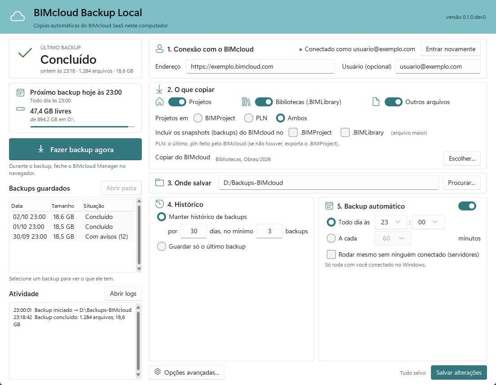

# BIMcloud Backup Local

Programa gratuito para Windows que guarda no seu computador, todo dia, uma cópia do que está no
**Graphisoft BIMcloud SaaS**: projetos Teamwork do Archicad, bibliotecas e demais arquivos.

*English: [summary at the end of this page](#english).*

> [!WARNING]
> Versão em desenvolvimento. O backup de arquivos e a exportação de projetos já foram testados
> num BIMcloud SaaS real; a exportação de bibliotecas ainda não.

## Funcionalidades

- Exporta os projetos (`.BIMProject`, o último `.pln` do BIMcloud, ou os dois) e as bibliotecas
  (`.BIMLibrary`), e copia os demais arquivos.
- Pode incluir os snapshots do BIMcloud nos arquivos exportados.
- Copia o BIMcloud inteiro ou só as pastas, projetos e bibliotecas que você marcar.
- Backup automático a cada tantos minutos, horas ou dias, inclusive num servidor sem ninguém
  conectado.
- Uma pasta com data e hora por backup; arquivos que não mudaram não são baixados de novo.
- Apaga os backups mais antigos que o prazo escolhido, sempre mantendo um mínimo.
- Para sozinho se passar do tempo máximo ou se o disco ficar sem espaço; pode ser cancelado a
  qualquer momento.
- Avisa pelo Windows quando um backup automático falha.
- Login na própria página do BIMcloud, com verificação em duas etapas. O programa nunca vê a sua
  senha.

## Requisitos

- Windows 10, Windows 11 ou Windows Server 2016 a 2025.
- Uma conta no BIMcloud SaaS do escritório.

## Instalação

Baixe os arquivos em [Releases](../../releases) (veja [Download](#download)).

- **Instalador:** abra o `BIMcloudBackup-Setup.exe`. Não pede permissão de administrador.
- **Sem instalar:** guarde o `BIMcloudBackup.exe` numa pasta fixa e abra por ali.

O programa não tem assinatura digital: se o Windows mostrar "O Windows protegeu o computador",
clique em **Mais informações** e em **Executar assim mesmo**.

## Configuração

Siga os passos numerados da janela e clique em **Salvar alterações**:

1. **Conexão com o BIMcloud:** informe o endereço do BIMcloud e clique em **Entrar no BIMcloud**.
2. **O que copiar:** projetos, bibliotecas e outros arquivos; **Escolher...** limita a algumas
   pastas.
3. **Onde salvar:** a pasta de destino dos backups.
4. **Histórico:** por quantos dias guardar os backups.
5. **Backup automático:** ligue a chave e escolha o horário.

## Uso

- Abra o programa pelo Menu Iniciar. **Fazer backup agora** testa na hora.
- Fechar a janela deixa o programa na área de notificação, perto do relógio. Para fechar de vez,
  use **Sair** no menu do ícone.
- O backup automático roda pelo Agendador de Tarefas do Windows, mesmo com o programa fechado.
- Não edite nada dentro das pastas de backup: para trabalhar num arquivo, copie-o antes.

## Atualização

Baixe a versão nova e rode o instalador por cima. A configuração, o login e o backup automático
continuam valendo.

## Download

Baixe a versão mais recente em [Releases](../../releases), o único lugar oficial de download.
Cada arquivo vem com um `.sha256` para conferir: `Get-FileHash .\BIMcloudBackup-Setup.exe` tem de
dar o mesmo código.

## Problemas comuns

- **"Acesso expirado: entre novamente":** clique em **Entrar novamente**.
- **O Windows bloqueia o programa sem oferecer "Executar assim mesmo":** é o Controle Inteligente
  de Aplicativos do Windows 11; veja o [guia](docs/GUIA.md#2-o-aviso-do-windows-ao-abrir).
- **O backup automático não rodou:** confira se o computador estava ligado e com você conectado,
  ou use a opção para servidores.
- **"Espaço livre abaixo de X GB":** libere espaço, troque o destino ou guarde menos dias.
- **Janelas "Salvar como" no navegador durante o backup:** feche o BIMcloud Manager no navegador.

Mais casos e o passo a passo completo estão no [Guia do usuário](docs/GUIA.md).

## Reportar um problema

Abra uma [issue](../../issues). Antes de anexar logs, troque os nomes de projetos, pastas e
clientes por genéricos, e nunca anexe arquivos `.pln`, `.BIMProject` ou `.BIMLibrary`.
Vulnerabilidades vão pelo reporte privado descrito no [SECURITY.md](SECURITY.md).

## Licença

[PolyForm Shield 1.0.0](LICENSE): uso gratuito, inclusive em escritórios e empresas. Não é
permitido vender o programa nem criar um produto concorrente com ele.

## Aviso

Este projeto é independente e não é afiliado, endossado ou patrocinado pela Graphisoft SE nem
pelo Grupo Nemetschek. *Graphisoft*, *Archicad* e *BIMcloud* são marcas dos seus titulares. O
programa é fornecido como está, sem garantias; não use como sua única cópia de segurança.

## English

**BIMcloud Backup Local** is a free Windows program (Windows 10, 11 and Server 2016 to 2025) that
makes scheduled local backups of **Graphisoft BIMcloud SaaS**: Archicad Teamwork projects,
libraries and other files. The interface is in Portuguese.

Download the installer from [Releases](../../releases), sign in with your BIMcloud address, choose
what to copy and where, and turn on the automatic backup. The program is not code-signed; if
Windows shows "Windows protected your PC", click **More info** and **Run anyway**.

License: [PolyForm Shield 1.0.0](LICENSE). Free to use, including by companies; you may not sell
it or build a competing product with it. Not affiliated with Graphisoft SE or the Nemetschek
Group. Provided as is, without warranty.

---

Copyright © 2026 Ettore Torres
