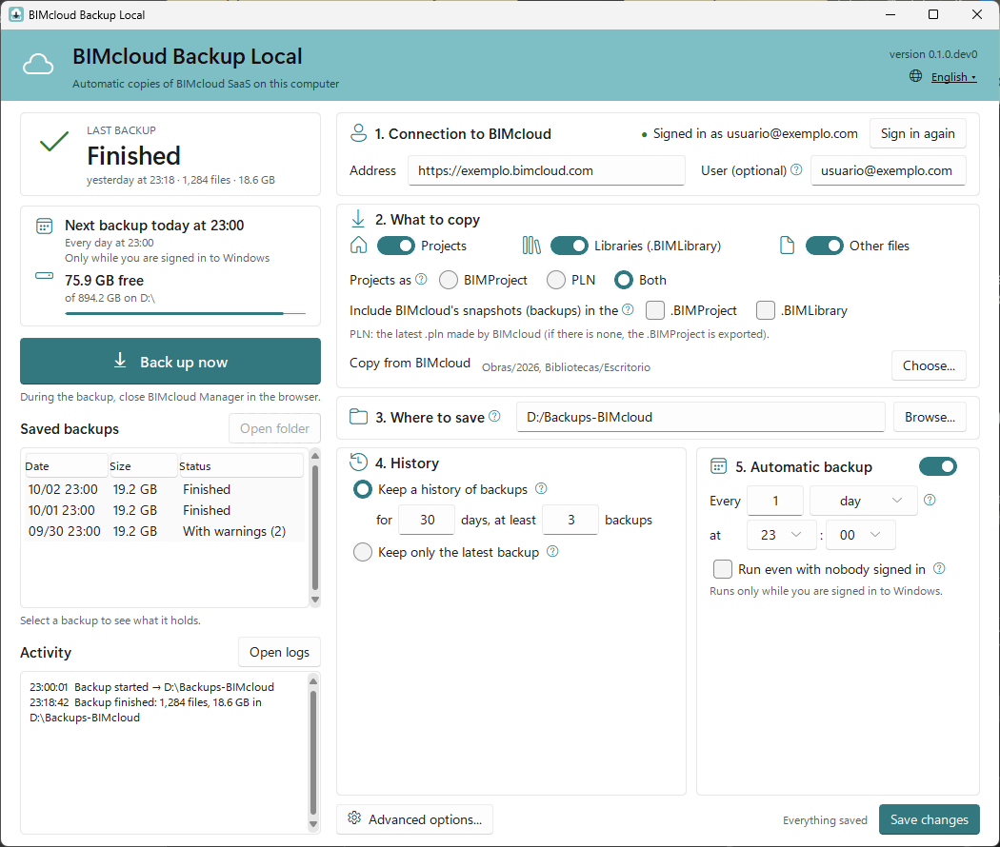
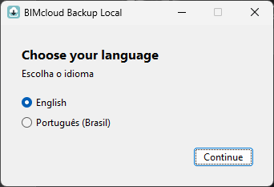
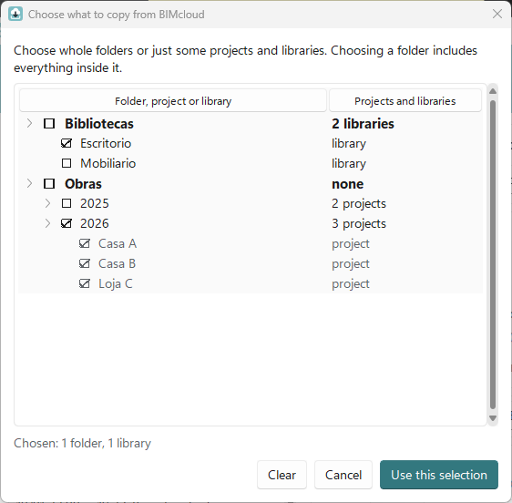
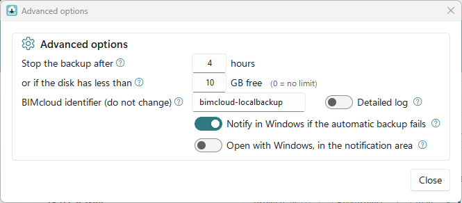
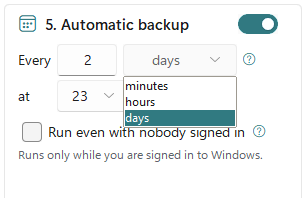

# User guide

English | [Português (Brasil)](GUIDE.pt-BR.md)

How to use BIMcloud Backup Local to keep on your computer a copy of what is on your office's
BIMcloud SaaS.

> The images in this guide use example data (`exemplo.bimcloud.com`, `usuario@exemplo.com`).

## Contents

1. [Download and install](#1-download-and-install)
2. [The Windows warning when opening](#2-the-windows-warning-when-opening)
3. [Sign in to BIMcloud](#3-sign-in-to-bimcloud)
4. [Choose what to copy from BIMcloud](#4-choose-what-to-copy-from-bimcloud)
5. [What to copy](#5-what-to-copy)
6. [Where to save, history and limits](#6-where-to-save-history-and-limits)
7. [Automatic backup](#7-automatic-backup)
8. [The saved backups](#8-the-saved-backups)
9. [Logs and items with errors](#9-logs-and-items-with-errors)
10. [Troubleshooting](#10-troubleshooting)
11. [How to restore](#11-how-to-restore)
12. [How to update](#12-how-to-update)
13. [Before asking for help: anonymize](#13-before-asking-for-help-anonymize)
14. [Using it on a server](#14-using-it-on-a-server)



On the left is the state of the backups: the last one, the next one, the free space, the
**Back up now** button, the **Saved backups** and the **Activity**. On the right are the
settings, in numbered steps. The settings only take effect after **Save changes**; until then,
**Back up now** and **Choose...** are disabled, and **Discard changes** goes back to what was
saved.

---

## 1. Download and install

1. Open the project's **Releases** page:
   <https://github.com/ETorres-GH/BIMcloudSaaS-LocalBackup/releases>. It is the only official
   download place.
2. In the latest version, download `BIMcloudBackup-Setup.exe` (installer, recommended) or
   `BIMcloudBackup.exe` (no installation), together with the `.sha256` of the same name.
3. Recommended: check the file. In the downloads folder, right-click an empty space, choose
   **Open in Terminal** and type:

   ```powershell
   Get-FileHash .\BIMcloudBackup-Setup.exe -Algorithm SHA256
   ```

   The code in the **Hash** column must be the same as the one in the `.sha256` (open it in
   Notepad). If it is different, delete the file and download it again.

### With the installer

Open `BIMcloudBackup-Setup.exe`, accept the license and, if you want, check the desktop
shortcut. The program is installed only for you, with no administrator rights, with a shortcut
in the Start menu.

To uninstall, use **Settings** → **Apps** → **BIMcloud Backup Local** → **Uninstall**. The
automatic backup is removed, and the uninstaller asks whether to delete the configuration, the
logs and the saved sign-in too. The backup folders are never deleted.

### With no installation

Keep `BIMcloudBackup.exe` in a fixed folder, for example `C:\Programs\BIMcloudBackup`. If you move
or delete the file after turning on the automatic backup, it stops working.

### Language

The first time, the program asks for the language, with **English** already selected: click
**Continue**, or choose **Português (Brasil)** and click **Continuar**. To change it later, click
the language in the top right corner of the window; the window changes at once. The Windows
notifications and the log follow the same language.



## 2. The Windows warning when opening

The program has no paid digital signature. The first time, Windows may show **"Windows protected
your PC"**: click **More info** and **Run anyway**.

### If "Run anyway" does not show up

On Windows 11, Smart App Control blocks unsigned programs. See whether it is on in **Windows
Security** → **App & browser control** → **Smart App Control settings**.

- If it is on, the only way to use this program is to turn it off. That removes a layer of
  protection from the computer; decide carefully (or with your office's IT).
- Update Windows first: in current versions the feature can be turned on again later.
- On computers managed by IT, talk to IT.

## 3. Sign in to BIMcloud

In step **1. Connection to BIMcloud**:

1. In **Address**, type the address you use in the browser to open BIMcloud Manager, starting
   with `https://`.
2. **User (optional):** your BIMcloud e-mail, only to have it filled in on the login page.
3. Click **Sign in to BIMcloud**. The browser opens the BIMcloud login page.
4. Sign in as usual, two-step verification included, within 5 minutes.
5. When it works, **"Signed in as <your user>"** shows up.

If the browser does not open, click **The browser did not open? Copy the login address** and open
that address in any browser, even on another computer.

Your password never goes through this program. The sign-in is kept in the Windows Credential
Manager, in your account, so the automatic backups do not ask you to sign in every time.

## 4. Choose what to copy from BIMcloud

In step **2. What to copy**, the line **Copy from BIMcloud** sums up what will be copied. With
nothing chosen, the whole BIMcloud is copied.

1. Click **Choose...** (you need to be signed in to BIMcloud and have no changes to save).
2. Each folder shows how many projects and libraries it has. Open the folders with the arrow.
3. Choose whole folders or just some projects and libraries. A folder in bold has something
   chosen inside it.
4. Click **Use this selection** (or **Clear** to copy everything) and **Save changes**.



In the backup, each item keeps the same path it has on BIMcloud. A chosen project is only copied
with **Projects** on, and a library, with **Libraries** on.

## 5. What to copy

- **Projects:** the Archicad Teamwork projects.
- **Libraries (.BIMLibrary):** the BIMcloud libraries.
- **Other files:** PDFs, images, spreadsheets and anything else uploaded to BIMcloud.

In **Projects as**, choose how each project is kept:

| Option | What you get | When to use it |
| --- | --- | --- |
| **BIMProject** | `.BIMProject`, the same file as the **Export** button of BIMcloud Manager | To bring the project back to BIMcloud with its Teamwork history |
| **PLN** | the latest `.pln` made by BIMcloud; if there is none, the `.BIMProject` | To open it straight in Archicad |
| **Both** | the two | The safest option, if there is room |

**Include BIMcloud's snapshots (backups)** in the `.BIMProject` or the `.BIMLibrary` also keeps
the snapshots BIMcloud has of each item. The file becomes much larger.

## 6. Where to save, history and limits

**3. Where to save:** the folder on this computer, on an external disk or on the network where
the backups are written.

**4. History:**

- **Keep a history of backups, for _X_ days, at least _Y_ backups:** each backup becomes a
  folder with date and time. Those older than _X_ days are deleted, but the _Y_ most recent ones
  are always kept.
- **Keep only the latest backup:** each successful backup replaces the previous one.

**Advanced options** (below step 5, or in the **Advanced options...** button on a shorter
window):



- **Stop the backup after _X_ hours** or **if the disk has less than _Y_ GB free** (`0` = no
  limit).
- **BIMcloud identifier (do not change):** only change it if support asks.
- **Notify in Windows if the automatic backup fails:** on by default.
- **Detailed log:** turn it on only to look into a problem.
- **Open with Windows, in the notification area:** off by default.

## 7. Automatic backup

In step **5. Automatic backup**:

1. Turn on the switch.
2. In **Every**, type the number and choose the unit: minutes, hours or days. With days, also
   choose the time in **at**. "Every 1 day at 23:00" is every day at 23:00.
3. Click **Save changes**.



The panel on the left then shows "Next backup ...".

- The backup runs through the Windows Task Scheduler, even with the program closed, while you are
  signed in to Windows (the screen may be locked). On a server, check **Run even with nobody
  signed in** (section 14).
- **Back up now** tests it right away. During the backup, the window shows the progress.
- **Cancel backup** stops in a few seconds; what was copied in that run is discarded and no old
  backup is deleted.
- If an automatic backup fails or the sign-in expires, Windows shows a notification in the
  corner of the screen.

> [!TIP]
> During the backup, close BIMcloud Manager in the browser. If it is open with your sign-in, the
> browser opens a **Save As** window for each export; you can cancel those windows.

### In the notification area

Closing the window with the **X** keeps the program in the notification area, near the clock (if
it does not show, click the **^** arrow). Rest the mouse on the icon to see how the last backup
went; a double click opens the window; the right button has **Open**, **Back up now** and
**Exit**. **Exit** during a backup cancels the backup before closing.

## 8. The saved backups

Each backup is a folder with date and time inside the destination folder, with the same path as
the BIMcloud folders:

```text
D:\BIMcloud-Backups\
├── 2026-09-26_230000\
└── 2026-09-27_230000\
    └── Works\
        └── 2026\
            ├── Project A.BIMProject29
            ├── Project A - 2026.09.27 16-00.pln
            └── Specification.pdf
```

> [!IMPORTANT]
> Do not edit anything inside the backup folders: a file that did not change is the same in
> several dates. To work on a file, copy it to another folder before opening it. Deleting a whole
> backup folder is safe.

A `.incomplete-<date>` folder is from an interrupted backup and is deleted at the next backup.

The **Saved backups** list shows each backup with date, size and status: **Finished**, **With
warnings (N)** (_N_ items failed), **Incomplete** or **No details** (the backup summary is
missing). Click a backup to see how many files it has and, if there were errors, **see which**.
**Open folder** opens the backup in File Explorer.

## 9. Logs and items with errors

| What | Where |
| --- | --- |
| Logs (one per day) | `%LOCALAPPDATA%\BIMcloudSaaS-LocalBackup\logs`. The **Open logs** button opens the folder |
| Configuration | `%APPDATA%\BIMcloudSaaS-LocalBackup\config.toml` (the window edits it; there is no need to open it) |
| BIMcloud sign-in | Windows Credential Manager |

An item that fails does not stop the backup. The **LAST BACKUP** panel shows, for example, "1
item with errors · see which": click it to see the path, the reason and what to do. **Copy
technical messages** copies the text to send to whoever is helping you (section 13).

| Reason shown | What to do |
| --- | --- |
| BIMcloud could not create the file | Export the item in BIMcloud Manager. If it fails there too, talk to Graphisoft support |
| The destination disk ran out of space | Free some space or choose another destination |
| BIMcloud took too long to answer | Try later, at a quieter time |
| The item no longer exists on BIMcloud | It was deleted, moved or renamed. Check the chosen folders |
| The access to BIMcloud expired | Click **Sign in again** and repeat the backup |
| The connection to BIMcloud dropped | Check the internet and repeat the backup |

## 10. Troubleshooting

| What shows up | What to do |
| --- | --- |
| **"Access expired: sign in again"** | Click **Sign in again**. The automatic backups work again right after |
| **"No connection to BIMcloud"** | Check the internet and the **Address**; open the same address in the browser |
| **"The login was not completed in 5 minutes."** | Click **Sign in to BIMcloud** again and finish the login in the browser |
| **"source folder not found on BIMcloud"** (or project, or library) | Something chosen was renamed, moved or deleted. Use **Choose...** and save again |
| **"Free space below X GB on ..."** | Free some space, choose another destination or keep fewer days |
| **"Time limit of X h reached"** | Raise the limit in **Advanced options**; the first backup is the slowest |
| **Save As** windows in the browser during the backup | Cancel them and close BIMcloud Manager in the browser during the backup |
| A project or library stays "queued" or "preparing" for a long time | BIMcloud is still creating the file. With no progress for 20 minutes, the program gives up that item and goes on with the rest (`export_stall_minutes` in `config.toml`) |
| **"A backup is already running in this folder"** | Wait for the other backup to finish |
| **Finished with errors** | Click **see which** (section 9). In that case the old backups are not deleted |
| The automatic backup did not run | Check that the computer was on with you signed in (in the server mode, whether the Windows password changed: section 14) and that `BIMcloudBackup.exe` is still in the same place. Saving again recreates the schedule |
| The **antivirus** blocked the program | Check the SHA-256 (section 1) and, if it matches, ask the antivirus or IT to allow the file |

## 11. How to restore

**A `.pln`:** copy it to a work folder and open it in Archicad (**File → Open**), in the same
version as the project or a newer one.

**A `.BIMProject` or `.BIMLibrary` back to BIMcloud:** in BIMcloud Manager, select the
destination folder and use **Import** (not **Upload**). See Graphisoft's help:
[Import Teamwork project or library](https://help.graphisoft.com/BC/INT/Topics/BCManager_Projects_Topics/t_TWProjectLibraryImport.html).

**Other files:** copy them from the backup folder.

Do a restore test with a small project before you really need it.

## 12. How to update

Download the new version from Releases (section 1) and run the installer over the old one, or
replace `BIMcloudBackup.exe` in the same place. The configuration, the sign-in and the automatic
backup keep working.

## 13. Before asking for help: anonymize

The logs have names of the office's projects, folders and clients (passwords and access keys are
already removed). Before attaching them to a request for help or to an issue:

- replace the names with generic ones (e.g. `ProjectA`, `FolderB`, `ClientC`);
- never attach `.pln`, `.BIMProject` or `.BIMLibrary` files.

## 14. Using it on a server

The program runs on Windows Server 2016, 2019, 2022 and 2025.

### Backup with nobody signed in

1. Sign in to the server's Windows with the account that will make the backups and, in it, sign
   in to BIMcloud through the program (section 3).
2. In step **5. Automatic backup**, turn on the switch and check **Run even with nobody signed
   in**.
3. Click **Save changes** and type the password of that Windows account. It stays with the
   Windows Task Scheduler, not with the program.

- Changed the Windows password? Open the program and click **Save changes**: it asks for the new
  password. Changing the time also asks for the password.
- "...is not allowed to run tasks while signed out": the account needs the **Log on as a batch
  job** right. Ask whoever manages the server.
- Use a regular user account, not a service account.

**Destination on the network:** use the `\\server\backups` path, not a mapped letter (`Z:`),
which does not exist with nobody signed in. The account must be able to write to the share.

**Sign-in:** if the server's browser does not open the BIMcloud page, use **Copy the login
address** (section 3) and sign in on any browser.

**Notifications:** with nobody signed in, the Windows notification does not show; the result is
in the "Last backup" panel and in the log.

### Server Core (no graphical interface)

In the **Command Prompt**, in the account that will make the backups:

1. Copy [`config.example.toml`](../config.example.toml) to the program's folder and create the
   configuration from it (address, destination, time and `run_logged_off = true`):

   ```bat
   mkdir "%APPDATA%\BIMcloudSaaS-LocalBackup"
   copy config.example.toml "%APPDATA%\BIMcloudSaaS-LocalBackup\config.toml"
   notepad "%APPDATA%\BIMcloudSaaS-LocalBackup\config.toml"
   ```

2. Run, in this order:

   ```bat
   start /wait "" BIMcloudBackup.exe check-config
   start /wait "" BIMcloudBackup.exe login
   start /wait "" BIMcloudBackup.exe run
   start /wait "" BIMcloudBackup.exe schedule install
   ```

   `login` shows an address to open in any browser. `schedule install` asks for the Windows
   password; `schedule status` shows how it turned out.

The command line uses the `language` of `config.toml` (`"en"` or `"pt-BR"`).

---

This program is independent and is not affiliated with Graphisoft. *Graphisoft*, *Archicad* and
*BIMcloud* are trademarks of their owners.
