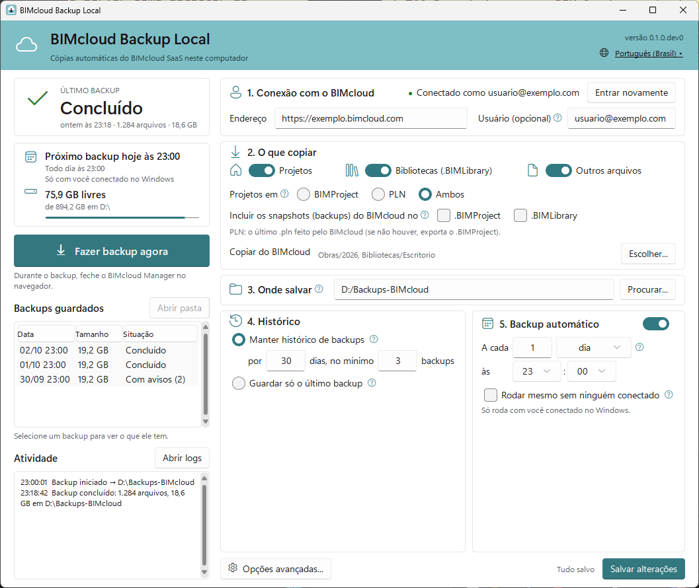
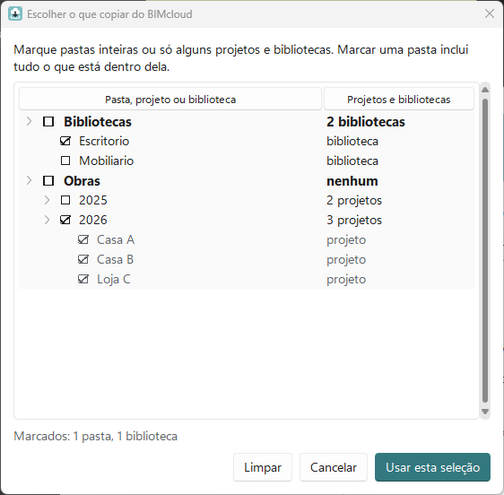
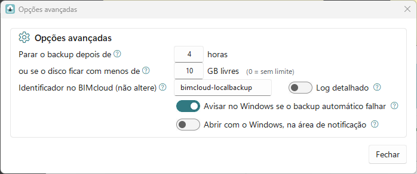
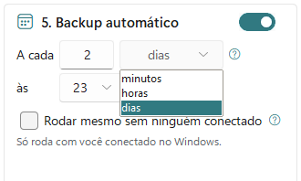

# Guia do usuário

[English](GUIDE.md) | Português (Brasil)

Como usar o BIMcloud Backup Local para guardar no seu computador uma cópia do que está no
BIMcloud SaaS do escritório.

> As imagens deste guia usam dados de exemplo (`exemplo.bimcloud.com`, `usuario@exemplo.com`).

## Sumário

1. [Baixar e instalar](#1-baixar-e-instalar)
2. [O aviso do Windows ao abrir](#2-o-aviso-do-windows-ao-abrir)
3. [Entrar no BIMcloud](#3-entrar-no-bimcloud)
4. [Escolher o que copiar do BIMcloud](#4-escolher-o-que-copiar-do-bimcloud)
5. [O que copiar](#5-o-que-copiar)
6. [Onde salvar, histórico e limites](#6-onde-salvar-histórico-e-limites)
7. [Backup automático](#7-backup-automático)
8. [Os backups guardados](#8-os-backups-guardados)
9. [Logs e itens com erro](#9-logs-e-itens-com-erro)
10. [Solução de problemas](#10-solução-de-problemas)
11. [Como restaurar](#11-como-restaurar)
12. [Como atualizar](#12-como-atualizar)
13. [Antes de pedir ajuda: anonimize](#13-antes-de-pedir-ajuda-anonimize)
14. [Usar num servidor](#14-usar-num-servidor)



À esquerda ficam a situação dos backups: o último, o próximo, o espaço livre, o botão **Fazer
backup agora**, os **Backups guardados** e a **Atividade**. À direita ficam os ajustes, em passos
numerados. Os ajustes só valem depois de **Salvar alterações**; até lá, **Fazer backup agora** e
**Escolher...** ficam desabilitados, e **Descartar alterações** volta ao que estava salvo.

---

## 1. Baixar e instalar

1. Abra a página **Releases** do projeto:
   <https://github.com/ETorres-GH/BIMcloudSaaS-LocalBackup/releases>. É o único lugar oficial de
   download.
2. Na versão mais recente, baixe o `BIMcloudBackup-Setup.exe` (instalador, recomendado) ou o
   `BIMcloudBackup.exe` (sem instalar), junto com o `.sha256` do mesmo nome.
3. Recomendado: confira o arquivo. Na pasta dos downloads, clique com o botão direito num espaço
   vazio, escolha **Abrir no Terminal** e digite:

   ```powershell
   Get-FileHash .\BIMcloudBackup-Setup.exe -Algorithm SHA256
   ```

   O código da coluna **Hash** tem de ser igual ao do `.sha256` (abra no Bloco de Notas). Se for
   diferente, apague e baixe de novo.

### Com o instalador

Abra o `BIMcloudBackup-Setup.exe`, aceite a licença e, se quiser, marque o atalho na área de
trabalho. O programa é instalado só para você, sem permissão de administrador, com um atalho no
Menu Iniciar.

Para desinstalar, use **Configurações** → **Aplicativos** → **BIMcloud Backup Local** →
**Desinstalar**. O backup automático é removido, e o desinstalador pergunta se deve apagar também
a configuração, os logs e o login guardado. As pastas de backup nunca são apagadas.

### Sem instalar

Guarde o `BIMcloudBackup.exe` numa pasta fixa, por exemplo `C:\Programas\BIMcloudBackup`. Se você
mover ou apagar o arquivo depois de ligar o backup automático, ele para de funcionar.

### Idioma

Na primeira vez, o programa pergunta o idioma, com **English** já marcado: escolha
**Português (Brasil)** e clique em **Continuar**. Para trocar depois, clique no idioma no canto
superior direito da janela; a janela muda na hora. Os avisos do Windows e o log seguem o mesmo
idioma.


## 2. O aviso do Windows ao abrir

O programa não tem assinatura digital paga. Na primeira vez, o Windows pode mostrar **"O Windows
protegeu o computador"**: clique em **Mais informações** e em **Executar assim mesmo**.

### Se não aparecer "Executar assim mesmo"

No Windows 11, o Controle Inteligente de Aplicativos (*Smart App Control*) bloqueia programas sem
assinatura. Veja se ele está ligado em **Segurança do Windows** → **Controle de aplicativos e do
navegador** → **Configurações do Controle Inteligente de Aplicativos**.

- Se estiver ligado, a única forma de usar este programa é desligá-lo. Isso tira uma camada de
  proteção do computador; decida com cuidado (ou com o TI do escritório).
- Atualize o Windows antes: nas versões atuais dá para ligar o recurso de novo depois.
- Em computadores administrados pelo TI, fale com o TI.

## 3. Entrar no BIMcloud

No passo **1. Conexão com o BIMcloud**:

1. Em **Endereço**, escreva o endereço que você usa no navegador para abrir o BIMcloud Manager,
   começando por `https://`.
2. **Usuário (opcional):** o seu e-mail do BIMcloud, só para vir preenchido no login.
3. Clique em **Entrar no BIMcloud**. O navegador abre a página de login do BIMcloud.
4. Entre como de costume, inclusive com a verificação em duas etapas, em até 5 minutos.
5. Quando der certo, aparece **"Conectado como <seu usuário>"**.

Se o navegador não abrir, clique em **O navegador não abriu? Copiar o endereço do login** e abra
esse endereço em qualquer navegador, até em outro computador.

A sua senha nunca passa por este programa. O login fica guardado no Gerenciador de Credenciais do
Windows, na sua conta, para os backups automáticos não pedirem login toda vez.

## 4. Escolher o que copiar do BIMcloud

No passo **2. O que copiar**, a linha **Copiar do BIMcloud** resume o que será copiado. Sem nada
marcado, o BIMcloud inteiro é copiado.

1. Clique em **Escolher...** (é preciso ter entrado no BIMcloud e não ter alterações por salvar).
2. Cada pasta mostra quantos projetos e bibliotecas tem. Abra as pastas pela setinha.
3. Marque pastas inteiras ou só alguns projetos e bibliotecas. Uma pasta em negrito tem algo
   marcado dentro.
4. Clique em **Usar esta seleção** (ou **Limpar** para copiar tudo) e em **Salvar alterações**.



No backup, cada item fica com o mesmo caminho que tem no BIMcloud. Um projeto marcado só é
copiado com **Projetos** ligado, e uma biblioteca, com **Bibliotecas** ligado.

## 5. O que copiar

- **Projetos:** os projetos Teamwork do Archicad.
- **Bibliotecas (.BIMLibrary):** as bibliotecas do BIMcloud.
- **Outros arquivos:** PDFs, imagens, planilhas e o que mais foi enviado ao BIMcloud.

Em **Projetos em**, escolha como cada projeto é guardado:

| Opção | O que você recebe | Quando usar |
| --- | --- | --- |
| **BIMProject** | `.BIMProject`, o mesmo arquivo do botão **Export** do BIMcloud Manager | Para devolver o projeto ao BIMcloud com o histórico de Teamwork |
| **PLN** | o `.pln` mais recente gerado pelo BIMcloud; se não houver, o `.BIMProject` | Para abrir direto no Archicad |
| **Ambos** | os dois | A opção mais segura, se houver espaço |

**Incluir os snapshots (backups) do BIMcloud** no `.BIMProject` ou no `.BIMLibrary` guarda
também os snapshots que o BIMcloud tem de cada item. O arquivo fica bem maior.

## 6. Onde salvar, histórico e limites

**3. Onde salvar:** a pasta do computador, de um disco externo ou da rede onde os backups são
gravados.

**4. Histórico:**

- **Manter histórico de backups, por _X_ dias, no mínimo _Y_ backups:** cada backup vira uma
  pasta com data e hora. As mais antigas que _X_ dias são apagadas, mas sempre ficam as _Y_ mais
  recentes.
- **Guardar só o último backup:** cada backup bem-sucedido substitui o anterior.

**Opções avançadas** (embaixo do passo 5, ou no botão **Opções avançadas...** numa janela mais
baixa):



- **Parar o backup depois de _X_ horas** ou **se o disco ficar com menos de _Y_ GB livres**
  (`0` = sem limite).
- **Identificador no BIMcloud (não altere):** só mude se o suporte pedir.
- **Avisar no Windows se o backup automático falhar:** ligado por padrão.
- **Log detalhado:** ligue só para investigar um problema.
- **Abrir com o Windows, na área de notificação:** desligado por padrão.

## 7. Backup automático

No passo **5. Backup automático**:

1. Ligue a chave.
2. Em **A cada**, digite o número e escolha a unidade: minutos, horas ou dias. Com dias, escolha
   também o horário em **às**. "A cada 1 dia às 23:00" é todo dia às 23:00.
3. Clique em **Salvar alterações**.



O quadro da esquerda passa a mostrar "Próximo backup ...".

- O backup roda pelo Agendador de Tarefas do Windows, mesmo com o programa fechado, enquanto você
  estiver conectado no Windows (a tela pode estar bloqueada). Num servidor, marque **Rodar mesmo
  sem ninguém conectado** (seção 14).
- **Fazer backup agora** testa na hora. Durante o backup, a janela mostra o andamento.
- **Cancelar backup** para em poucos segundos; o que foi copiado naquela execução é descartado e
  nenhum backup antigo é apagado.
- Se um backup automático falhar ou o login expirar, o Windows mostra um aviso no canto da tela.

> [!TIP]
> Durante o backup, feche o BIMcloud Manager no navegador. Se ele estiver aberto com o seu login,
> o navegador abre uma janela **Salvar como** para cada exportação; pode cancelar essas janelas.

### Na área de notificação

Fechar a janela no **X** deixa o programa na área de notificação, perto do relógio (se não
aparecer, clique na setinha **^**). Passe o mouse sobre o ícone para ver como foi o último backup;
o clique duplo abre a janela; o botão direito tem **Abrir**, **Fazer backup agora** e **Sair**.
**Sair** durante um backup cancela o backup antes de fechar.

## 8. Os backups guardados

Cada backup é uma pasta com data e hora dentro da pasta de destino, com o mesmo caminho das
pastas do BIMcloud:

```text
D:\Backups-BIMcloud\
├── 2026-09-26_230000\
└── 2026-09-27_230000\
    └── Obras\
        └── 2026\
            ├── Projeto A.BIMProject29
            ├── Projeto A - 2026.09.27 16-00.pln
            └── Memorial.pdf
```

> [!IMPORTANT]
> Não edite nada dentro das pastas de backup: um arquivo que não mudou é o mesmo em várias datas.
> Para trabalhar num arquivo, copie-o para outra pasta antes de abrir. Apagar uma pasta de backup
> inteira é seguro.

Uma pasta `.incomplete-<data>` é de um backup interrompido e é apagada no backup seguinte.

A lista **Backups guardados** mostra cada backup com data, tamanho e situação: **Concluído**,
**Com avisos (N)** (_N_ itens falharam), **Incompleto** ou **Sem detalhes** (o resumo do backup
falta). Clique num backup para ver quantos arquivos ele tem e, se houve erros, **ver quais**.
**Abrir pasta** abre o backup no Explorador de Arquivos.

## 9. Logs e itens com erro

| O quê | Onde |
| --- | --- |
| Logs (um por dia) | `%LOCALAPPDATA%\BIMcloudSaaS-LocalBackup\logs`. O botão **Abrir logs** abre a pasta |
| Configuração | `%APPDATA%\BIMcloudSaaS-LocalBackup\config.toml` (a janela edita; não é preciso abrir) |
| Login no BIMcloud | Gerenciador de Credenciais do Windows |

Um item que falha não interrompe o backup. No quadro **ÚLTIMO BACKUP** aparece, por exemplo, "1
item com erro · ver quais": clique para ver o caminho, o motivo e o que fazer. **Copiar mensagens
técnicas** copia o texto para enviar a quem for ajudar (seção 13).

| Motivo mostrado | O que fazer |
| --- | --- |
| O BIMcloud não conseguiu gerar o arquivo | Exporte o item pelo BIMcloud Manager. Se falhar lá também, fale com o suporte da Graphisoft |
| Faltou espaço no disco de destino | Libere espaço ou escolha outro destino |
| O BIMcloud demorou demais para responder | Tente mais tarde, num horário de menos uso |
| O item não existe mais no BIMcloud | Foi apagado, movido ou renomeado. Confira as pastas escolhidas |
| O acesso ao BIMcloud expirou | Clique em **Entrar novamente** e repita o backup |
| A conexão com o BIMcloud caiu | Confira a internet e repita o backup |

## 10. Solução de problemas

| O que aparece | O que fazer |
| --- | --- |
| **"Acesso expirado: entre novamente"** | Clique em **Entrar novamente**. Os backups automáticos voltam a funcionar em seguida |
| **"Sem conexão com o BIMcloud"** | Confira a internet e o **Endereço**; abra o mesmo endereço no navegador |
| **"O login não foi concluído em 5 minutos."** | Clique em **Entrar no BIMcloud** de novo e conclua o login no navegador |
| **"pasta de origem não encontrada no BIMcloud"** (ou projeto, ou biblioteca) | Algo escolhido foi renomeado, movido ou apagado. Use **Escolher...** e salve de novo |
| **"Espaço livre abaixo de X GB em ..."** | Libere espaço, escolha outro destino ou guarde menos dias |
| **"Tempo máximo de X h atingido"** | Aumente o limite em **Opções avançadas**; o primeiro backup é o mais demorado |
| Janelas **Salvar como** no navegador durante o backup | Cancele-as e feche o BIMcloud Manager no navegador durante o backup |
| Um projeto ou biblioteca fica muito tempo "na fila" ou "preparando" | O BIMcloud ainda está gerando o arquivo. Sem avanço por 20 minutos, o programa desiste daquele item e segue com o resto (`export_stall_minutes` no `config.toml`) |
| **"Já existe um backup em andamento nesta pasta"** | Espere o outro backup terminar |
| **Concluído com erros** | Clique em **ver quais** (seção 9). Nesse caso os backups antigos não são apagados |
| O backup automático não rodou | Confira se o computador estava ligado com você conectado (no modo para servidores, se a senha do Windows mudou: seção 14) e se o `BIMcloudBackup.exe` continua no mesmo lugar. Salvar de novo recria o agendamento |
| O **antivírus** bloqueou o programa | Confira o SHA-256 (seção 1) e, se bater, peça ao antivírus ou ao TI para liberar o arquivo |

## 11. Como restaurar

**Um `.pln`:** copie para uma pasta de trabalho e abra no Archicad (**Arquivo → Abrir**), na
mesma versão do projeto ou mais nova.

**Um `.BIMProject` ou `.BIMLibrary` de volta ao BIMcloud:** no BIMcloud Manager, selecione a
pasta de destino e use **Import** (não **Upload**). Veja a ajuda da Graphisoft:
[Import Teamwork project or library](https://help.graphisoft.com/BC/INT/Topics/BCManager_Projects_Topics/t_TWProjectLibraryImport.html).

**Outros arquivos:** copie da pasta de backup.

Faça um teste de restauração com um projeto pequeno antes de precisar de verdade.

## 12. Como atualizar

Baixe a versão nova em Releases (seção 1) e rode o instalador por cima, ou troque o
`BIMcloudBackup.exe` no mesmo lugar. A configuração, o login e o backup automático continuam
valendo.

## 13. Antes de pedir ajuda: anonimize

Os logs contêm nomes de projetos, pastas e clientes do escritório (senhas e chaves de acesso já
são removidas). Antes de anexá-los a um pedido de ajuda ou a uma issue:

- troque os nomes por genéricos (ex.: `ProjetoA`, `PastaB`, `ClienteC`);
- nunca anexe arquivos `.pln`, `.BIMProject` ou `.BIMLibrary`.

## 14. Usar num servidor

O programa roda no Windows Server 2016, 2019, 2022 e 2025.

### Backup sem ninguém conectado

1. Entre no Windows do servidor com a conta que vai fazer os backups e, nela, entre no BIMcloud
   pelo programa (seção 3).
2. No passo **5. Backup automático**, ligue a chave e marque **Rodar mesmo sem ninguém conectado**.
3. Clique em **Salvar alterações** e digite a senha dessa conta do Windows. Ela fica com o
   Agendador de Tarefas do Windows, não com o programa.

- Trocou a senha do Windows? Abra o programa e clique em **Salvar alterações**: ele pede a senha
  nova. Mudar o horário também pede a senha.
- "...não tem permissão para rodar tarefas sem estar conectada": a conta precisa do direito
  **Fazer logon como um trabalho em lotes**. Peça ao responsável pelo servidor.
- Use uma conta de usuário comum, não uma conta de serviço.

**Destino na rede:** use o caminho `\\servidor\backups`, não uma letra mapeada (`Z:`), que não
existe sem ninguém conectado. A conta precisa poder gravar no compartilhamento.

**Login:** se o navegador do servidor não abrir a página do BIMcloud, use **Copiar o endereço do
login** (seção 3) e entre em qualquer navegador.

**Avisos:** sem ninguém conectado, o aviso do Windows não aparece; o resultado fica no quadro
"Último backup" e no log.

### Server Core (sem interface gráfica)

No **Prompt de Comando**, na conta que vai fazer os backups:

1. Copie o [`config.example.toml`](../config.example.toml) para a pasta do programa e crie a
   configuração a partir dele (endereço, destino, horário e `run_logged_off = true`):

   ```bat
   mkdir "%APPDATA%\BIMcloudSaaS-LocalBackup"
   copy config.example.toml "%APPDATA%\BIMcloudSaaS-LocalBackup\config.toml"
   notepad "%APPDATA%\BIMcloudSaaS-LocalBackup\config.toml"
   ```

2. Rode, nesta ordem:

   ```bat
   start /wait "" BIMcloudBackup.exe check-config
   start /wait "" BIMcloudBackup.exe login
   start /wait "" BIMcloudBackup.exe run
   start /wait "" BIMcloudBackup.exe schedule install
   ```

   O `login` mostra um endereço para abrir em qualquer navegador. O `schedule install` pede a
   senha do Windows; `schedule status` mostra como ficou.

A linha de comando usa o `language` do `config.toml` (`"en"` ou `"pt-BR"`).

---

Este programa é independente e não é afiliado à Graphisoft. *Graphisoft*, *Archicad* e
*BIMcloud* são marcas dos seus titulares.
